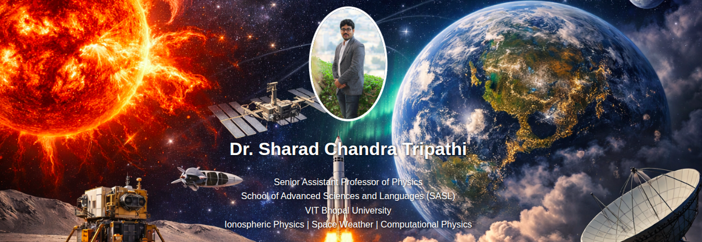

  

# Dr. Sharad Chandra Tripathi – Academic Website

Personal academic website of **Dr. Sharad Chandra Tripathi**, physicist specializing in **Solar Physics, Space Weather, Ionospheric Physics, Plasma Physics, and Computational Physics**.

🌐 Website: [https://sharadctripathi.github.io](https://sharadctripathi.github.io)

This site hosts research updates, teaching resources, physics articles, science blogs, and educational material for students, researchers, and science enthusiasts interested in space science and atmospheric physics.

---

## About

Dr. Tripathi earned his **Ph.D. in Physics from Barkatullah Vishwavidyalaya, Bhopal**, was awarded the **Erasmus Mundus INTACT Fellowship**, and completed **post-doctoral research at Frederick University, Cyprus**. His research focuses on **Sun–Earth interactions, ionospheric plasma dynamics, geomagnetic storms, and computational physics**.

---

## Sections

- **Home** – Overview & profile  
- **Research** – Projects & publications  
- **Teaching** – Labs & educational resources  
- **Science Blog** – Science communication  
- **Physics Articles** – Explanatory articles  
- **News** – Updates on conferences & activities  

---

## Contact
📧 risingsharad@gmail.com  
📧 sharadchandra.tripathi@vitbhopal.ac.in  
📧 drsharadctripathi@gmail.com  

---

© 2026 Dr. Sharad Chandra Tripathi
